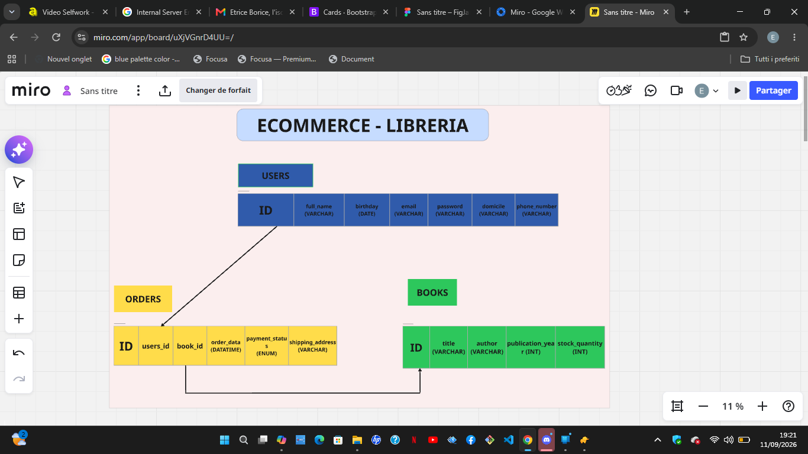
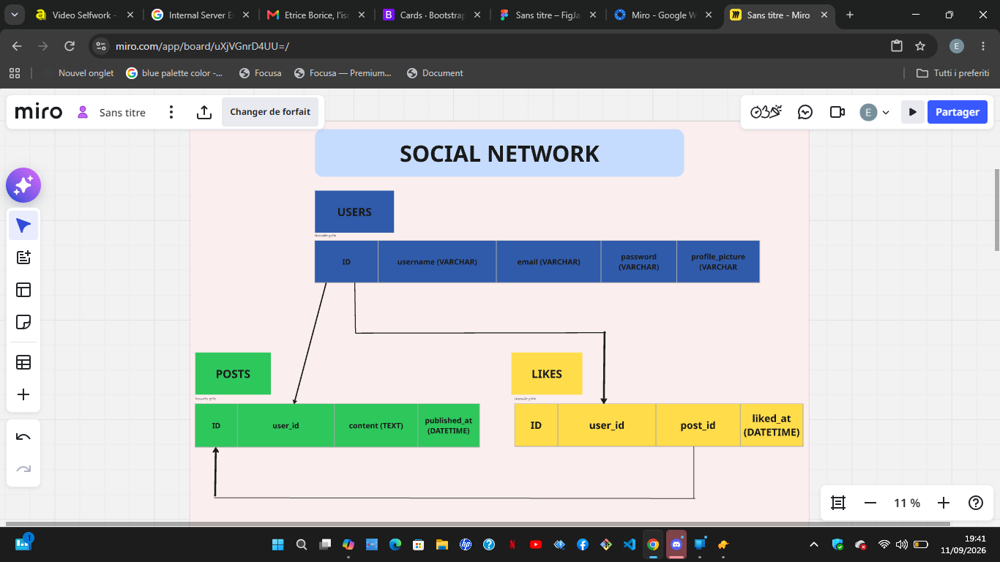
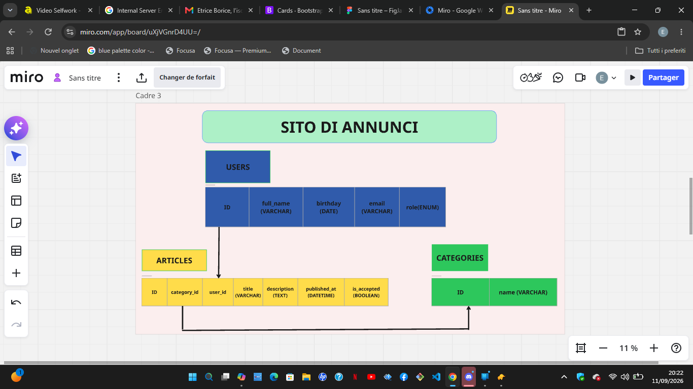

# 📘 Selfwork – Introduzione ai Database  
Progetto Hackademy – Settembre 2026

Questo repository contiene i tre schemi database richiesti nel selfwork.  
Ogni schema è stato progettato con attenzione alla struttura, alle relazioni e alla coerenza dei dati.

---

## 📚 1. E‑commerce Libreria  
Schema del database per un sistema di acquisto libri online.  
Include utenti, libri, ordini e relazioni tra le entità.

### 📷 Schema

---

## 💬 2. Social Network  
Schema del database per una piattaforma social con utenti, post e likes.  
Progettato per gestire interazioni, contenuti e attività degli utenti.

### 📷 Schema

---

## 📢 3. Sito di Annunci  
Schema del database per un portale di annunci con categorie, revisori e articoli pubblicati dagli utenti.

### 📷 Schema

---

## 🔗 Board Miro  
Puoi visualizzare tutti gli schemi anche sulla board Miro dedicata:  
👉 https://miro.com/app/board/uXjVGnrD4UU=/

---

## 📁 Struttura della Repository

